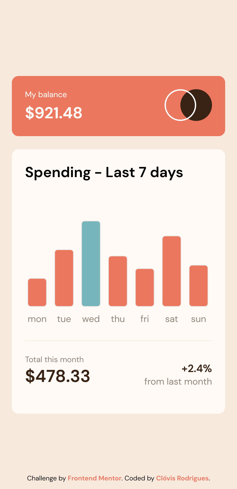
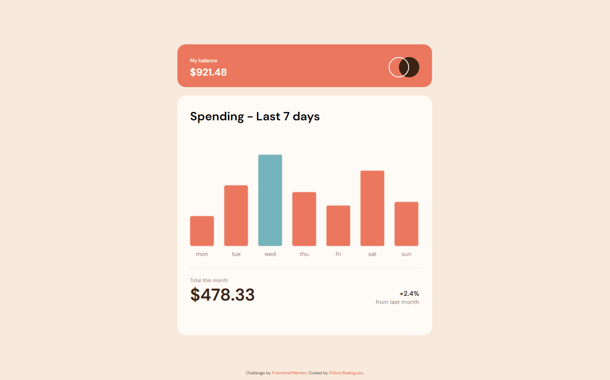

# Sobre o Projeto
Projeto clone do desafio [FrontEnd Mentor](https://www.frontendmentor.io/challenges/expenses-chart-component-e7yJBUdjwt), nesse projeto foi utilizado a lib [Chart.js](https://www.chartjs.org/docs/latest/) 
para montar o gráfico.

## Desing Mobile	

## Design Desktop

## Tecnologias utilizadas
* HTML
* CSS
* JS
* Chart.js
